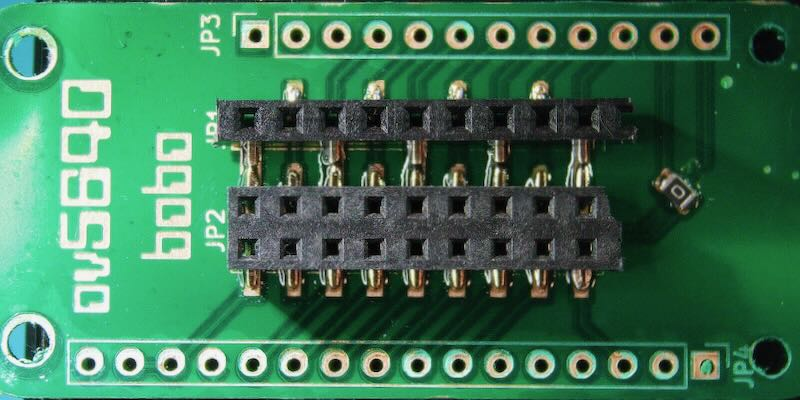
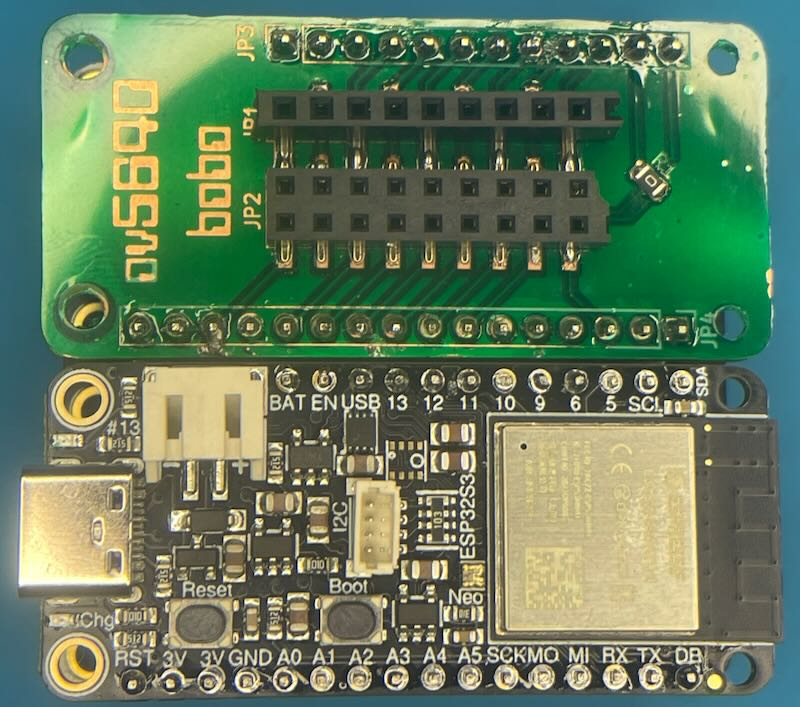
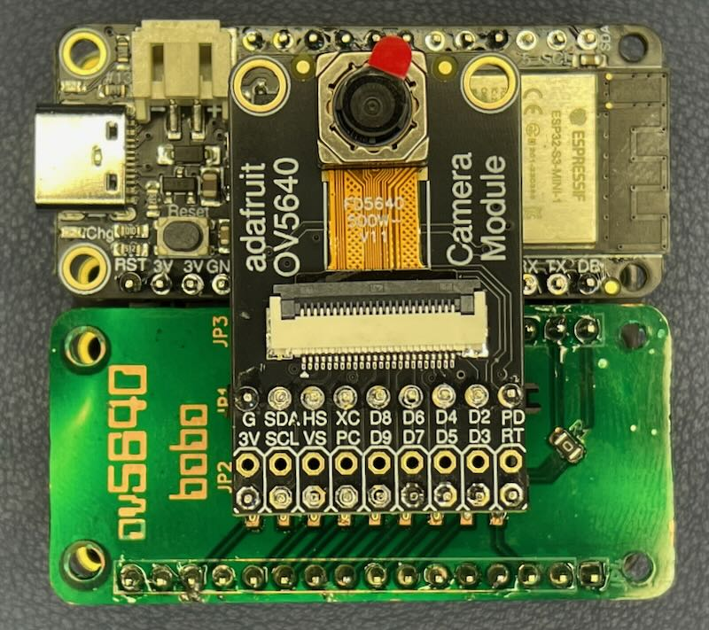
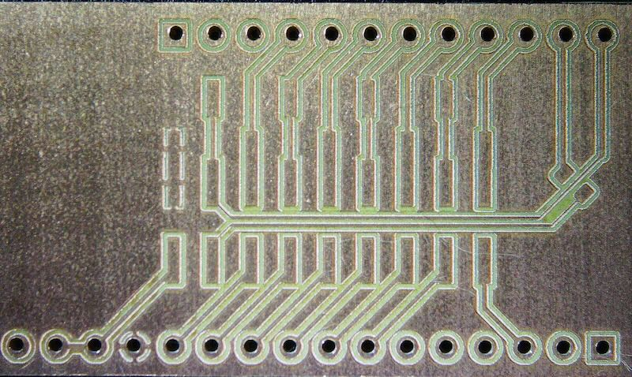
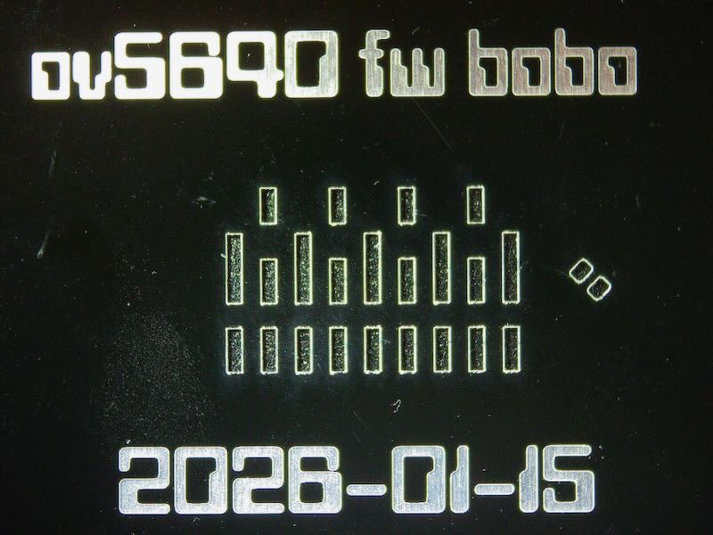
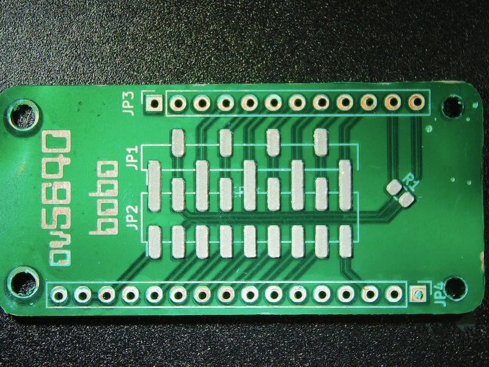
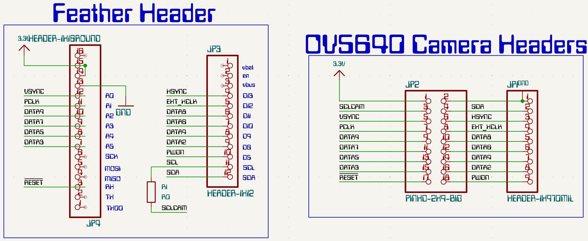
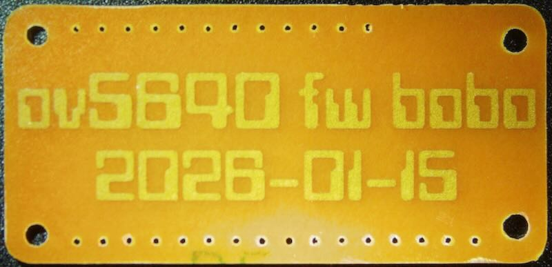

# OV5640 FeatherWing BoBo  

FeatherWing PCB that connects to the OV5640 camera breakout module from Adafruit 

---

## Overview

- OV5640 camera breakout supports both header configurations
- Converts the OV5640 Breakout to a FeatherWing format
- Leaves SPI pins available for SD / SDIO use
- Third header row for breadboard-friendly layouts
- Single Sided PCB for easy rapid prototyping at home
- Compatible with **most Feather boards**
- Tested with **Feather ESP32-S3**

---

## BOM

| Item | Description |
|---|---|
| [Adafruit ESP32-S3 Feather with 4MB Flash 2MB PSRAM – STEMMA QT / Qwiic](https://www.adafruit.com/product/5477) | ESP32-S3 Feather board with 4 MB Flash, 2 MB PSRAM |
| [Adafruit OV5640 Camera Breakout – 120 Degree Lens with Autofocus](https://www.adafruit.com/product/5838) | OV5640 camera module, 120° lens, autofocus |
| [FeatherWing Doubler – Prototyping Add-on For All Feather Boards](https://www.adafruit.com/product/2890) | FeatherWing prototyping add-on board |
| [Single-row SMT headers](https://www.aliexpress.us/item/3256805008610566.html) | Surface-mount single-row pin headers |
| [Double-row SMT headers](https://www.aliexpress.us/item/3256803267239198.html) | Surface-mount double-row pin headers |

---

## Backstory

**OV5640 FeatherWing BoBo** was created to solve a real-world wiring problem discussed on the [Adafruit](https://forums.adafruit.com/viewtopic.php?t=221951) f(https://github.com/jerryneedell/mycamera). Wiring 18 pins by hand is a messy process.

Special thanks to [jerryn for his reference design and example code](https://github.com/jerryneedell/mycamera). 

---

## Etching Settings

---

## Stencil

---

## Schematic

---

## PCB

---

## Snapshot Test Code

---
